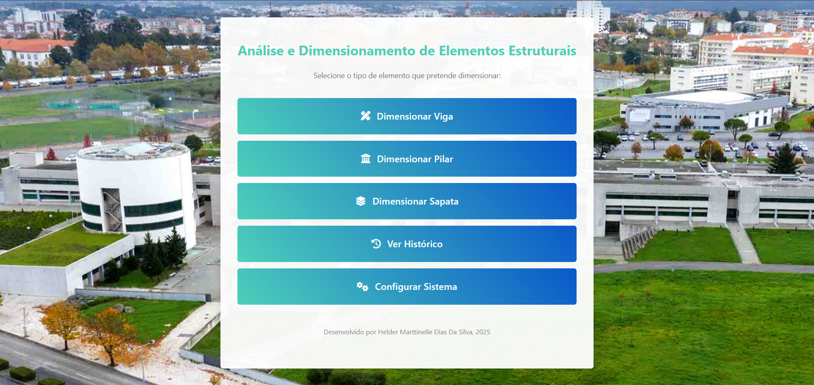

# Calculadora de Dimensionamento Estrutural (Eurocódigo 2)

Este projeto é uma aplicação web desenvolvida em Django, criada no âmbito da minha Diseertação para mestrado em IPV. A sua principal função é auxiliar no dimensionamento de elementos estruturais de betão armado, seguindo as diretrizes da norma portuguesa **NP EN 1992-1-1:2010 (Eurocódigo 2)**.

A ferramenta permite a engenheiros e estudantes de engenharia civil realizar cálculos de forma rápida e precisa, gerando memórias de cálculo detalhadas e representações gráficas das secções.



## Funcionalidades Principais

O sistema está preparado para dimensionar os seguintes elementos estruturais:

* **Dimensionamento de Vigas à Flexão Simples:**
    * Calcula a armadura longitudinal positiva necessária para resistir a um dado momento fletor.
    * Otimiza a escolha da armadura, sugerindo a solução mais económica (diâmetro único ou misto).
    * Verifica os requisitos de armadura mínima e ductilidade.

* **Dimensionamento de Pilares à Flexão Composta:**
    * Calcula a armadura longitudinal para pilares sujeitos a esforço axial e momento fletor.
    * Verifica a esbelteza do pilar e calcula os efeitos de 2ª ordem, se necessário.
    * Garante a escolha de uma combinação de armadura simétrica e construtivamente adequada.

* **Dimensionamento de Sapatas Isoladas:**
    * Realiza o dimensionamento geotécnico (dimensões em planta) e estrutural (altura e armaduras).
    * Verifica a segurança ao punçoamento e à flexão.

* **Geração de Relatórios:**
    * Exporta uma memória de cálculo detalhada em formato PDF para cada dimensionamento.
    * Inclui os dados de entrada, os resultados finais, o passo a passo dos cálculos e uma representação gráfica do elemento.

* **Histórico de Cálculos:**
    * Guarda um registo de todos os cálculos efetuados para consulta futura.

* **Personalização da Interface:**
    * Permite ao utilizador alterar o tema da aplicação (claro/escuro), a cor principal e a imagem de fundo.

---

## Tecnologias Utilizadas

* **Backend:** Python, Django
* **Frontend:** HTML, CSS, JavaScript
* **Geração de PDF:** WeasyPrint
* **Base de Dados:** SQLite3 (padrão do Django)

---

## Instalação e Execução Local

Para executar este projeto no seu computador, siga os passos abaixo.

**Pré-requisitos:**
* Python 3.10 ou superior
* Git

**Passos:**

1.  **Clonar o repositório:**
    ```bash
    git clone [https://github.com/Hmarttinelle/Tese_Final.git](https://github.com/Hmarttinelle/Tese_Final.git)
    ```

2.  **Navegar para a pasta do projeto:**
    ```bash
    cd Tese_Final
    ```

3.  **Criar e ativar um ambiente virtual:**
    ```bash
    # Criar o ambiente
    python -m venv venv

    # Ativar no Windows
    .\venv\Scripts\activate

    # Ativar no macOS/Linux
    source venv/bin/activate
    ```

4.  **Instalar as dependências:**
    ```bash
    pip install -r requirements.txt
    ```

5.  **Aplicar as migrações da base de dados:**
    ```bash
    python manage.py migrate
    ```

6.  **Executar o servidor de desenvolvimento:**
    ```bash
    python manage.py runserver
    ```

7.  Aceda à aplicação no seu navegador através do endereço: `http://127.0.0.1:8000/`

---

## Estrutura do Projeto

* `projeto_estrutural/`: Contém as configurações principais do projeto Django (`settings.py`, `urls.py`, etc.).
* `calculos/`: A aplicação principal do Django onde toda a lógica está implementada.
    * `services/`: Módulos Python com os algoritmos de cálculo para cada tipo de elemento.
    * `static/`: Ficheiros estáticos (CSS, imagens dos ícones).
    * `templates/`: Ficheiros HTML que definem a interface da aplicação.
    * `views.py`: Controla a lógica das páginas web e a interação com os serviços de cálculo.
* `manage.py`: Utilitário de linha de comandos do Django.
* `requirements.txt`: Lista de todas as dependências do projeto.

---

## Desenvolvimento Futuro (Próximos Passos)

Este projeto tem uma base sólida que pode ser expandida com novas funcionalidades, tais como:

* [ ] Dimensionamento de vigas ao **esforço transverso** (cálculo de estribos).
* [ ] Cálculo de **armadura negativa** em vigas.
* [ ] Dimensionamento de **lajes maciças e aligeiradas**.
* [ ] Implementação de um sistema de **autenticação de utilizadores** para guardar cálculos por conta.

---

## Autor

**Helder Marttinelle Dias Da Silva** - *Projeto desenvolvido para a Dissertação do Mestrado - IPV - 2025*